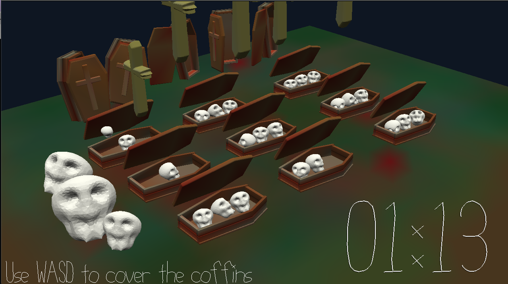

# Discordant-Resurrection

Author: Wei-Che (Wizard) Hsu

Design: Find the discordant coffins, kill the human skulls, and protect the consonant coffins.

Screen Shot:

How To Play:

Now there are some human skulls hide in the vampire coffins. The human skulls cause the coffin to create a discordant sound. When you use the WASD to cover the coffin, the current chord sound would be played. Try your best to find the discordant coffin and let the crosses kill the skull. If the current chord is consonant, you have to protect that. That means if the two skulls are consonant you have to protect all of them until the game end. When the game end, it would evaluate each coffin. The consonant coffin could get extra points.

Sound Pipeline:

Import the 13 pithes: C, C#, D, D# ... C separately and then read the pitchDesign.txt to create different kinds of chords and assign how many skulls should be left in each coffin.

Sources: 

This game was built with [NEST](NEST.md).

The pitch sound is created by BeepBox.

The coffin opened sound is from: https://elements.envato.com/metal-coffin-open-lid-C8QKLP4?utm_source=mixkit&utm_medium=referral&utm_campaign=elements_mixkit_cs_sfx_search_no_results

The background music is from: https://www.storyblocks.com/audio/stock/enchanted-forest-dark-spooky-drone-ambience-hl3mn62iphk0wxx9cp.html (preview version)
